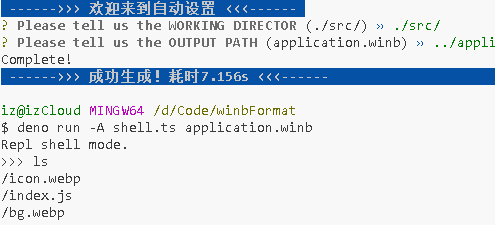

# WinB格式 工具
快速生成、拆解WinB应用包文件。
支持`create.ts`创建/`shell.ts`虚拟交互界面

# 何为.Winb?
`.winb`就是将一批文件打包在一起，使用JSON存储相关内容，如元数据
`.winb`设计之初就是为了高速拆包，只需要读取一部分就可以得到文件列表、元数据
`.winb`没有压缩，因此直接seek就可以读取相应文件的数据，可以轻松做到stream解压
`.winb`用于为WinB提供双击即可运行的体验，因此我们写了这个工具快速处理

# 为开发者提供的API
`vendor/mkwinb.ts` 用于创建`.winb`文件
`vendor/winb.ts` 用于修改、读取文件
`application-schema.json` 用于规范配置

# src文件夹仅供演示，用于演示功能
删除`_cache.json`以重新配置。记得在询问额外的文件时加入`bg.webp`
